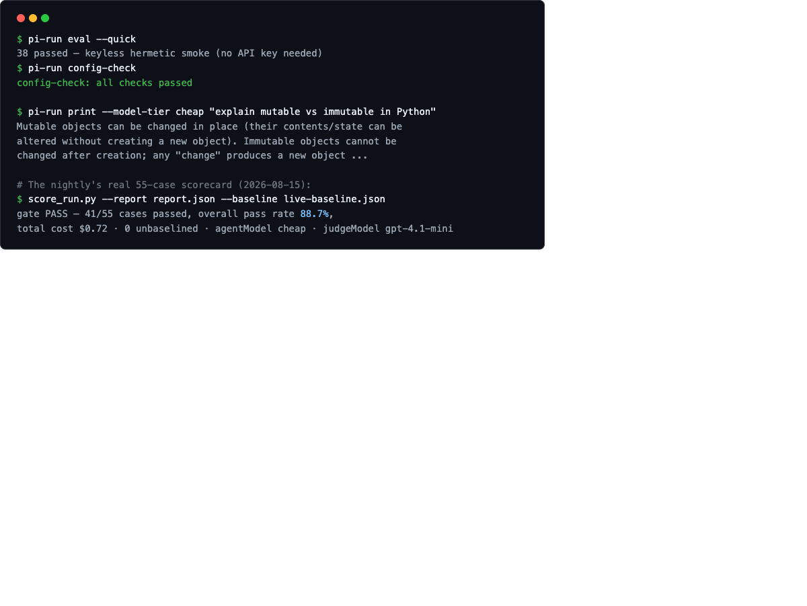
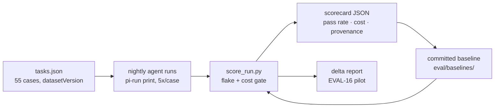

# Pi Coding Agent Harness

**Point `pi-run` at a provider, get a real coding agent, get an *honest* pass-rate and cost over a versioned contract — and trust it not to hang or silently lie.**

[](https://opensource.org/licenses/MIT)
[](https://github.com/forrestbthomas/pi-harness/actions/workflows/ci.yml)
[](https://github.com/forrestbthomas/pi-harness/releases)
[](https://github.com/forrestbthomas/pi-harness/blob/main/eval/baselines/live-baseline.json)

> One product: the harness. The eval suite is its **measurement layer** — not a
> separate product. We do **not** build a PM system, a spec library, an
> observability platform, or a general MCP platform. See
> [`CHARTER.md`](CHARTER.md) for the boundary contract.

## It measures itself — here's a real scorecard

Every night the harness runs a real coding agent against **55 live eval cases**
across 7 categories, 5 runs each, and gates the result against a committed
baseline. This is the actual scorecard from the 2026-08-15 run (not a mock):

| | |
|---|---|
| **Pass rate** | **88.7%** (41/55 cases at/above baseline) |
| **Cost** | **$0.72** per full night (cheap agent tier) |
| **Unbaselined cases** | **0** — every case has a committed reference |
| **Provenance** | agentModel `cheap` · judgeModel `gpt-4.1-mini` · datasetVersion `2026-08-15.1` |
| **Honest bounds** | 14 cases recorded at sub-1.0 rates — low pass rates are *reported*, never hidden |

```text
$ pi-run eval --quick
38 passed — keyless hermetic smoke (no API key needed)
$ pi-run config-check
config-check: all checks passed
$ pi-run print --model-tier cheap "explain mutable vs immutable in Python"
Mutable objects can be changed in place (their contents/state can be
altered without creating a new object). Immutable objects cannot be
changed after creation; any "change" produces a new object ...
```



## The loop



A change to the harness reports its own scorecard delta; the drift guards run
in CI on every PR; the eval has **caught its own bugs** — each one became a
graded eval case (e.g. `coding-055`, the debugging case that tests exactly this
skill).

## Why this is different

- **Self-healing by default** — an output-stall watchdog, process-group kill
  (SIGTERM → grace → SIGKILL), and git-state auto-recovery mean a hung or
  wedged run resolves itself or escalates with evidence (`.pi/heal/` + exit 9).
  It never needs a human nudge.
- **A gate that can't lie** — flake-aware pass-rate and median-shift cost
  gates: a single flaky run or an intrinsically noisy cost case never
  false-fails; low pass rates are recorded as honest baseline bounds, and
  unbaselined cases are never silently skipped.
- **Provider-agnostic, explicit** — **17 providers in total** (OpenAI,
  OpenRouter, DeepSeek, Anthropic, Gemini, Groq, local Ollama/vLLM, Azure,
  Bedrock, …) via a data-driven table; keys env-first, secret-store optional;
  **no automatic cross-provider fallback** — the provider is always explicit.
- **Real cost, no price tables** — spend comes from the actual session files
  (`usage.cost`), per provider/model, with a hard budget cap (exit 6).
- **One versioned contract** — `tasks.json → score_run.py → scorecard` is the
  seam; measurement is reproducible and provenance-carrying (datasetVersion,
  agentModel, judgeModel, piVersion).
- **The loop measures itself** — EVAL-16 scorecard-delta reports and GOV-1/3
  drift guards in CI mean the harness's own honesty is enforced, not assumed.

## Install

**macOS with Homebrew (recommended):**

```bash
brew install forrestbthomas/tap/pi-run
pi-run config-check        # no API key needed for this
```

**From source (macOS/Linux/WSL):**

```bash
git clone https://github.com/forrestbthomas/pi-harness.git
cd pi-harness
bash scripts/bootstrap.sh   # Node + pi + bin/pi-run + eval/.venv
export OPENAI_API_KEY=sk-...   # or OPENROUTER_API_KEY / DEEPSEEK_API_KEY
bin/pi-run doctor
```

Prerequisites: Node.js via nvm (override with `PI_NODE_VERSION`), Python 3.11+
(for the eval suite), Go 1.26+ (only to build/update `pi-run`), and an API key.

## Quick start

```bash
# Launch Pi interactively (OpenAI → gpt-5.6-terra by default)
pi-run chat

# One-shot query, cheap tier, any provider
pi-run print --model-tier cheap "summarize this repo"
pi-run chat --provider deepseek

# The harness's own health + eval smoke (no API key needed)
pi-run config-check
pi-run eval --quick
```

The full reference (every command, env var, provider, hook, budget, benchmark)
lives in **[`docs/reference.md`](docs/reference.md)**.

## How the measurement works

- **Nightly live eval** — 55 live cases, 5 runs each, LLM-judged metrics
  (majority-of-3), gated against `eval/baselines/live-baseline.json` with a
  0.05 pass-rate tolerance and a flake-aware cost gate. Missing provider key =
  hard failure, never a silent skip. Budget-capped at $2/night; artifacts kept
  90 days.
- **Hermetic smoke** — `pi-run eval --quick` (38 keyless hermetic tests) and
  `pi-run config-check` run keyless, so the harness verifies itself anywhere.
- **Provider scorecard in CI** — `pi-run ci-benchmark` runs the Docker-isolated
  benchmark suite against 2+ providers and gates the build on pass rate,
  budget, and regression vs a previous scorecard.
- **Self-heal observability** — `PI_SELF_HEAL=1` records watchdog events to
  `.pi/heal/events.jsonl`, surfaced in the scorecard.

## Configuration essentials

| Env var | Purpose |
|---|---|
| `PI_PROVIDER` | Default provider when `--provider` is omitted (default `openai`) |
| `PI_MODEL_TIER` | Default model tier (`fast`/`balanced`/`cheap`) |
| `PI_PERMISSION_MODE` | Default permission tier (`default`/`plan`/`acceptEdits`/`bypassPermissions`) |
| `PI_MAX_BUDGET_USD` | Default spend cap for `chat`/`print` |
| `PI_SECRET_BACKEND` | `bitwarden` (default), `1password`/`op`, or `env-only` |
| `PI_SELF_HEAL` | Set `1` to record watchdog events to `.pi/heal/events.jsonl` |
| `PI_STALL_TIMEOUT_SECS` | Watchdog silent-window (default 300; 0 disables) |
| `PI_WATCHDOG_GRACE_SECS` | Group-kill grace between SIGTERM and SIGKILL (default 10) |
| `OPENAI_MODEL_NAME` | Judge model pin for LLM-judged metrics |

Exit codes: `0` ok · `1` generic · `2` usage · `3` missing API key · `4` node/pi not found · `5` eval venv missing · `6` budget exceeded · `7` docker unavailable · `8` scorecard gate failed · `9` **watchdog terminated** (stall/group-kill timeout). The full table (all 21 env vars, provider rows, hooks, permissions) is in [`docs/reference.md`](docs/reference.md).

> **Memory is optional — default none.** The harness ships no memory engine;
> the docs are the source of truth; any memory engine is user-loaded via
> `.pi/settings.json` packages.

## Docs & governance

- **[`docs/reference.md`](docs/reference.md)** — the manual (commands, env,
  providers, hooks, budgets, troubleshooting)
- **[`CHARTER.md`](CHARTER.md)** — what this project is (and is not)
- **[`docs/benchmark-seam.md`](docs/benchmark-seam.md)** — the versioned seam
  contract (`tasks.json → score_run.py → scorecard`)
- **[`docs/anti-lockin.md`](docs/anti-lockin.md)** — BYO-key / BYO-model
- **[`CONTRIBUTING.md`](CONTRIBUTING.md)** — setup, testing, the
  [`good first issue`](https://github.com/forrestbthomas/pi-harness/labels/good%20first%20issue)
  path, and the 7-day review SLA
- **[`SECURITY.md`](SECURITY.md)** — private vulnerability reporting
